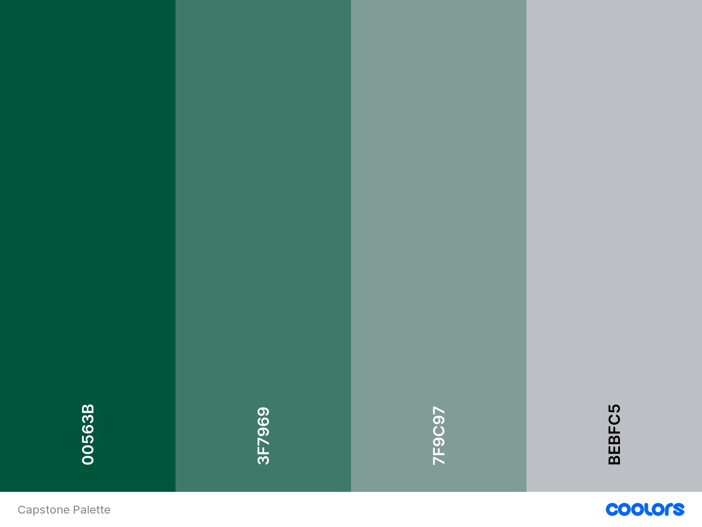
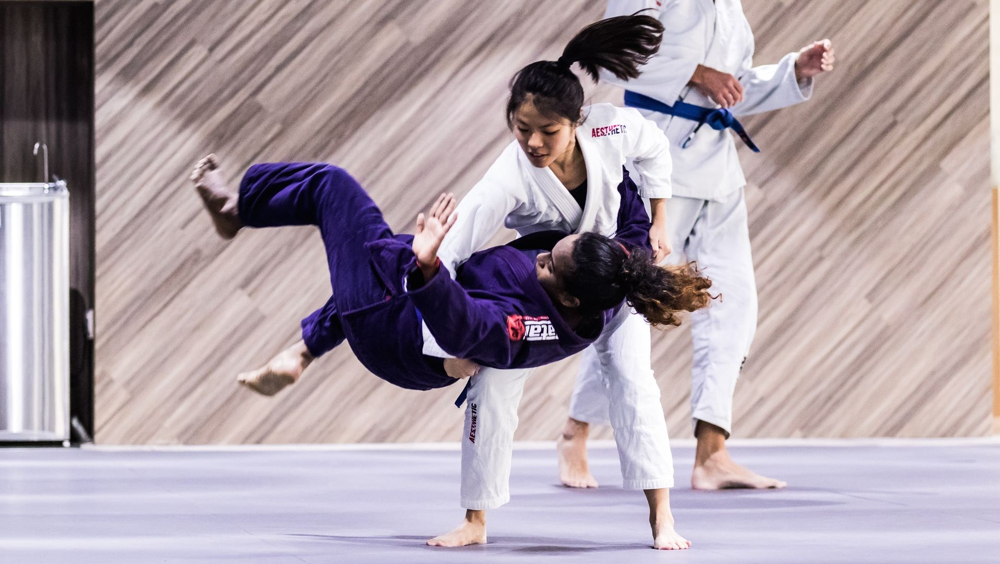
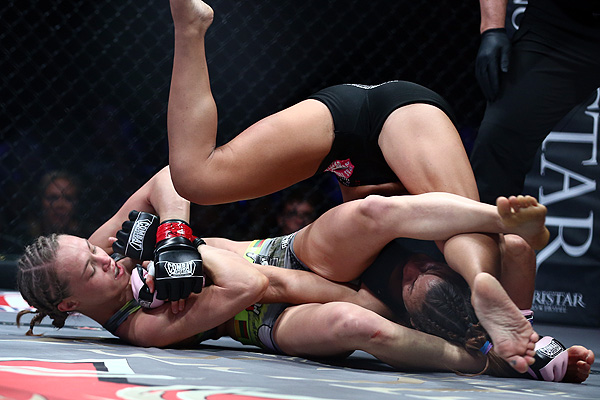
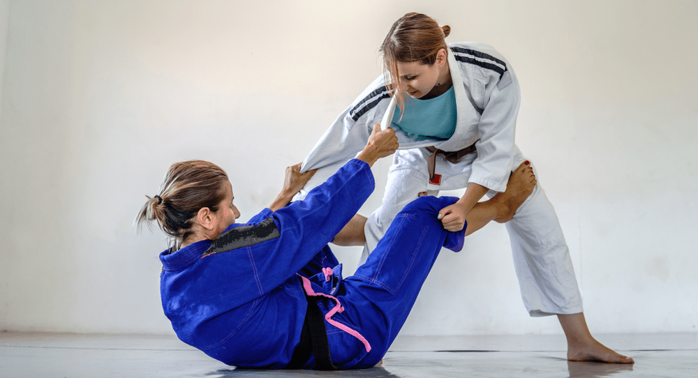
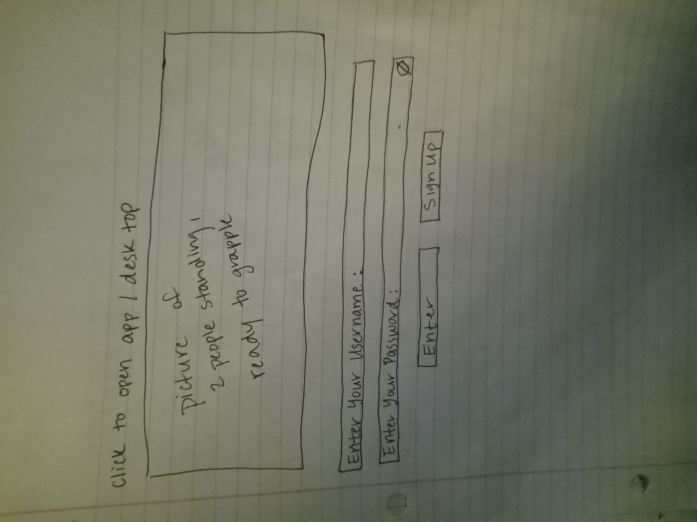
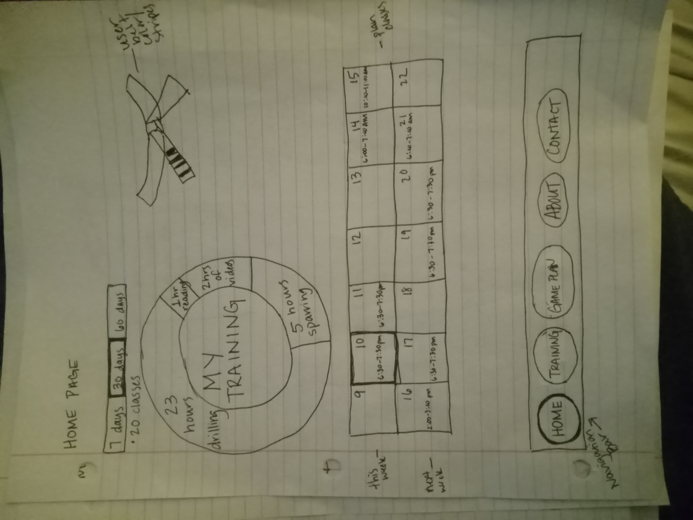
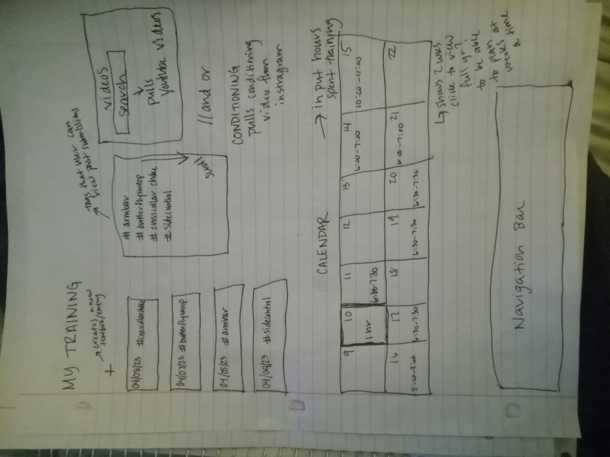
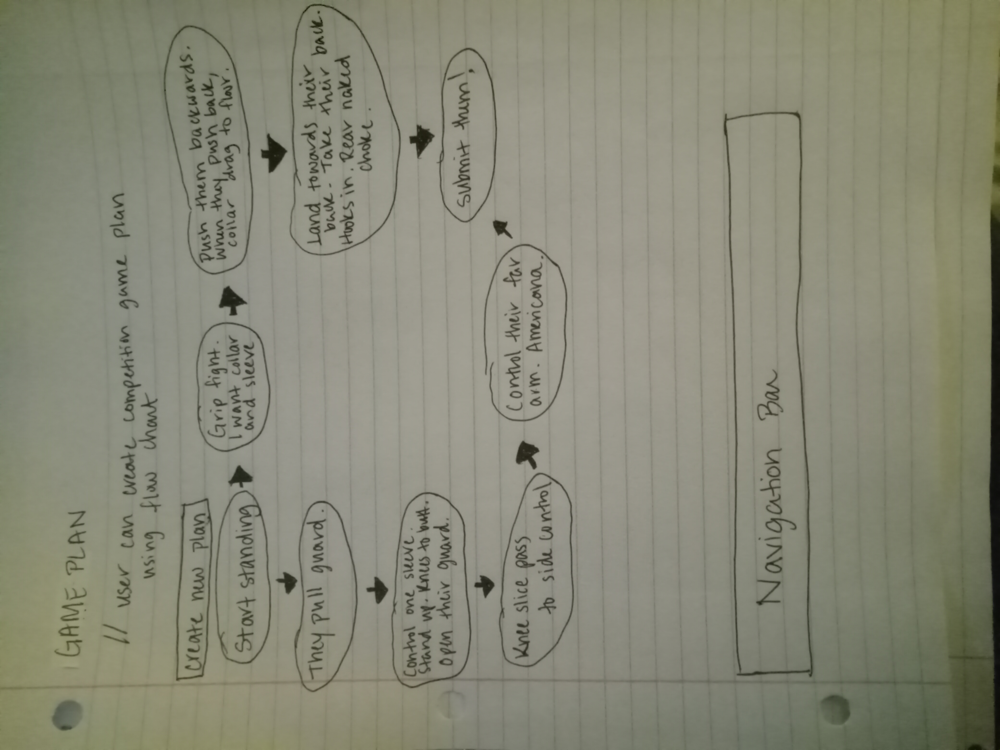
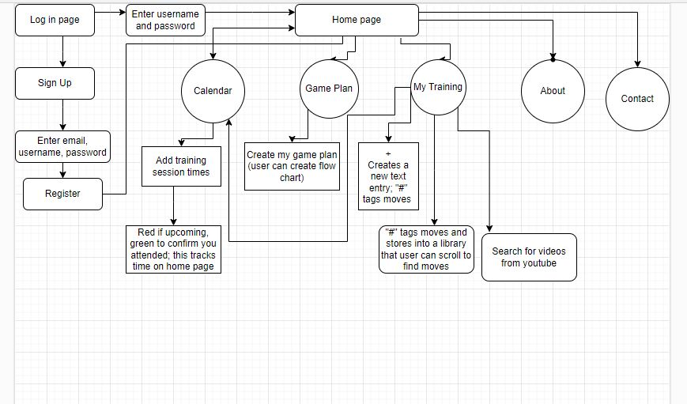

# Capstone Work

## <u>Definition Statement</u>
### I want to build an application that tracks jiu jitsu classes that you’ve been to and stores the information you learned in that class in a journal form. You would then be able to revisit moves you have learned and continuously add details. You would also be able to view these moves in the app for review.
## <u>Definition of Audience</u>
### The target audience of this app is a very niche crowd – people that practice jiu jitsu (beginners).

## <u>Outline of Content</u>
### What I want on each page:
#### Home Page
  - What is jiu jitsu?
      - Jiu jitsu, knowl as Brazilian Jiu-Jitsu or simply BJJ, is a ground-based martial art that focuses on grappling with an opponent and maintaining control of them. The goal is to utilize control over your opponent, leading them to submit or tap out.
  - Why practice?
      - // Include health benefits in this section
  - What is jiu jitsu good for?
      - // Include self-defense here and competition training/fun
  - Find a gym near you
      - This would somehow be a search bar to find schools near user's location
  - Pictures – 1 arm bar or choke, 1 standing ready to start
  - // Maybe include an inspirational quote at the bottom
#### My Moves
-	This would be the journal page that tracks your classes. Text box to input what you have learned in a given class. Maybe each main textbox has “reply” textboxes where you can revisit these moves and add details to what you have already learned.
-	Maybe a search or link to youtube to search for videos of moves you want to look at
#### My Game
-	This page may be unnecessary. I also don't know how to make this happen. I am envisioning users being able to create a flow chart where you can make your game plan.
- For example - In a competition we start standing -> I want a sleeve and collar grip -> Drive them backwards and when they start to push forward I collar drag to the ground -> On the way down, take their back -> right arm around around and under neck and come clasp both my hands with a C-grip -> squeeze right arm while dragging my left elbow down -> rear naked chock and submit them
#### About
  - // Write about why I created this page, passion for jiu jitsu/how practicing this sport benefitted my life
#### Contact Us
  - // Contact information?
### What is the purpose of my application?
  - The purpose of this application is to help novice jiu jitsu practitioners keep track of their lessons, further detail what they learn, review their moves, and improve their practice.
### Color Palette
  - 
  - /* CSS HEX */
--castleton-green: #00563Bff;
--hookers-green: #3F7969ff;
--cambridge-blue: #7F9C97ff;
--french-gray: #BEBFC5ff;

/* CSS HSL */
--castleton-green: hsla(161, 100%, 17%, 1);
--hookers-green: hsla(163, 32%, 36%, 1);
--cambridge-blue: hsla(170, 13%, 55%, 1);
--french-gray: hsla(231, 6%, 76%, 1);

/* SCSS HEX */
$castleton-green: #00563Bff;
$hookers-green: #3F7969ff;
$cambridge-blue: #7F9C97ff;
$french-gray: #BEBFC5ff;

/* SCSS HSL */
$castleton-green: hsla(161, 100%, 17%, 1);
$hookers-green: hsla(163, 32%, 36%, 1);
$cambridge-blue: hsla(170, 13%, 55%, 1);
$french-gray: hsla(231, 6%, 76%, 1);

/* SCSS RGB */
$castleton-green: rgba(0, 86, 59, 1);
$hookers-green: rgba(63, 121, 105, 1);
$cambridge-blue: rgba(127, 156, 151, 1);
$french-gray: rgba(190, 191, 197, 1);

/* SCSS Gradient */
$gradient-top: linear-gradient(0deg, #00563Bff, #3F7969ff, #7F9C97ff, #BEBFC5ff);
$gradient-right: linear-gradient(90deg, #00563Bff, #3F7969ff, #7F9C97ff, #BEBFC5ff);
$gradient-bottom: linear-gradient(180deg, #00563Bff, #3F7969ff, #7F9C97ff, #BEBFC5ff);
$gradient-left: linear-gradient(270deg, #00563Bff, #3F7969ff, #7F9C97ff, #BEBFC5ff);
$gradient-top-right: linear-gradient(45deg, #00563Bff, #3F7969ff, #7F9C97ff, #BEBFC5ff);
$gradient-bottom-right: linear-gradient(135deg, #00563Bff, #3F7969ff, #7F9C97ff, #BEBFC5ff);
$gradient-top-left: linear-gradient(225deg, #00563Bff, #3F7969ff, #7F9C97ff, #BEBFC5ff);
$gradient-bottom-left: linear-gradient(315deg, #00563Bff, #3F7969ff, #7F9C97ff, #BEBFC5ff);
$gradient-radial: radial-gradient(#00563Bff, #3F7969ff, #7F9C97ff, #BEBFC5ff);

#### Images

- I want to take own pics and videos and incorporate. I will start taking pics and videos during my jiu jitsu classes starting Fri 4/14.

#### Fonts
  - Cabin Sketch
  - Black Ops One
  - Sintony

#### Logos
  - create my own logo?

#### Navigation
  - create the navigation bar?

### <u>Mural Story Map</u>
  - https://app.mural.co/t/lhodge9855/m/lhodge9855/1679624935351/1a5f0ef510c639ef8d97ac6bb52f22b3b72138d6?sender=ud4721716ff95de1ee5404845

### <u>Research</u>
  - https://www.bjjsuccess.com/best-bjj-apps/
    - Marune
      - Like: it tracks progress by log training hours and sparring time, and you can also track other combat sports
      - How my app will be different: you will be able to log the moves you learn, and not just the hours you train
    - BJJBuddy
      - Like: tracks training rounds, cardio, and calories burned and can add notes
      - Love: chart for visual aid
      - My app will be more focused on the moves. I do love the idea of including an app showing hours trained for the month to track progress.
    - Combat Academy: training log app that allows you to log training sessions, write training notes, upload video and images of techniques
      - Love: upload own videos, and can track sparring vs drilling; note number of submissions, takedowns, escapes, etc attempted vs executed
      - Also love: social feed that shows your training partners' notes
    - BJJ Roadmap
      - Like: ebook; takes user through basic beginner moves and has videos and reading resources
      - Dislike: the app itself is free, but you have to purchase the material

### <u>Wireframes</u>

### <u>User Flow Diagram</u>
https://app.diagrams.net/#Heat-a-p3ach%2FHomework%2Fdevelopment%2FWeek1%2FUntitled%20Diagram.drawio

### <u>SWOT Analysis</u>
https://app.mural.co/t/lhodge9855/m/lhodge9855/1681140775333/ca4ae5d4427f42ca61de3a5c94a893c458acf4b5?sender=ud4721716ff95de1ee5404845

 
